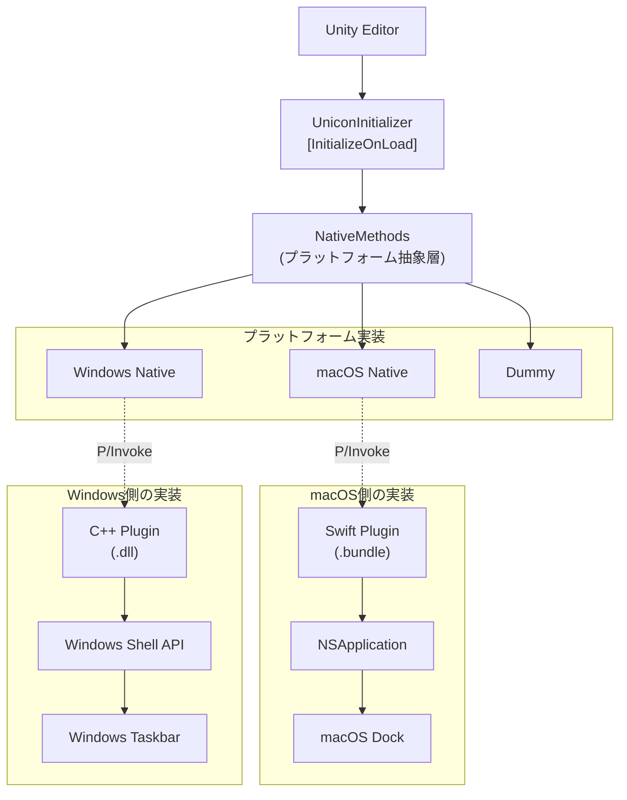

# 初めに

この記事は [QualiArts アドベントカレンダー 2025](https://qiita.com/advent-calendar/2025/qualiarts)の 10 日目です。

# 前書き

最近、ClaudeCode などの AI エージェントに自走させていると、並列で複数の Unity Editor を立ちあげる機会が多くなりました。

以前から作業プロジェクトと基板プロジェクトなどの 2 エディタぐらいを並列で開くことはあったのですが、AI エージェントを併走させるとなると平気で 3,4 個同時に立ちあげることとなり、判別がかなり難しくなったと感じます。

そのため、次の gif のように Unity の画像が任意の物に差し替わるようにしてみます。

# 使い方

下の項目で実装方法を書いていくのですが、とりあえずアイコンを差し替えたいと言う方は、[GitHub の README](https://github.com/AtaruMatsudaira/Unicon/blob/main/Packages/com.mattun.unicon/README_ja.md#%E3%82%A4%E3%83%B3%E3%82%B9%E3%83%88%E3%83%BC%E3%83%AB)を参考にインストールしてください。

OpenUPM と Git 形式に対応しています。

インストールしたら、Preferences から Unicon の項目を選び、

1. Enable Custom Dock Icon を有効 (赤枠)
2. 任意の項目を設定(緑枠)
   - 設定は画像/OverlayColor/テキストをそれぞれ設定出来ます
3. Apply Current Settings をクリックすれば反映されます

実行時やコンパイル時に一瞬だけ消えることもありますが、少し経てば設定してた画像に戻ります。

# 内部実装

## 全体アーキテクチャ

以下の図は、Unity Editor から各プラットフォーム実装までの流れを示したものです。
C#層で抽象化を行い、各プラットフォームネイティブ実装でアイコンを更新しています。

## MacOS での実装

### ネイティブ上でのアイコンの扱い

まず前提として、MacOS は標準で提供されてる Dock アイコン上でのプログレスバーという物が特に存在しません。

Unity のコンパイルや Import 時のプログレスの表現は、標準の Unity アイコンの上に Progress 表示が入った画像を用意して、それを進捗にあわせ表示していると推察されます。

そのため今回のアプローチとしては、設定種別 (画像/オーバーレイ/テキスト)に関わらず、内容に応じた[NSImage](https://developer.apple.com/documentation/appkit/nsimage)のインスタンスを作成し、[NSApplication.shared.applicationIconImage](https://developer.apple.com/documentation/appkit/nsapplication/applicationiconimage) に設定することとしました。

また、カスタム画像が設定されていない際、ユーザが期待するのはデフォルトのアイコンの上にテキストなどが書き足されている状態だと思います。
そのため、デフォルトの画像は`<UnityEditorアプリケーションのPath>/Contents/Resources/UnityAppIcon.icns`を参照するようにしました。

NSApplication.shared.applicationIconImage のドキュメントでは

> Assign an image to this property when you want to **temporarily** change the app icon in the dock app tile. The image you provide is scaled as needed so that it fits in the tile. To restore your app’s original icon, set this property to nil.

とあるので、任意の画像をここに投げればよさそうですし、リセットしたいときも `nil` をツッコめば良さそうです。

これらを行う関数を Swift で実装して cdecl で公開し、ビルドした bundle ファイルを Unity プロジェクト上に配置して実行したらアイコンが変更出来たのを確認出来ました。

### Unity 側の画像の扱い

とりあえず、任意の画像を設定出来るようになりました。

ただし、

- “temporarily change the app icon in the dock app tile” とあるように、一時的にアイコンを差し替える
- プログレスの表示を上記と同じ方法で実現している

と言うこともあり、InitializeOnLoad のタイミングで一度だけアイコンを設定しても、ロードが走る度すぐにアイコンが元の物に戻ってしまうという問題がありました。

そのため、MacOS のエディタ上では

- 1 秒ごと (InitializeOnLoad 時に`EditorApplication.update` に引っかける)
- コンパイル後[DidReloadScripts](https://docs.unity3d.com/ScriptReference/Callbacks.DidReloadScripts.html)属性に引っかける)

と、頻繁にアイコンを設定することで Unity 側から上書かれても即時に元のアイコンに戻るようにしました。

## Windows での実装

元々、Unicon は MacOS のみのサポートを予定していました。
OSS として v1.0.0 を公開したところ、私とおなじくサイバーエージェントグループの Applibot に所属する同期の [焼き鯖くん](https://x.com/yakisabananoka)が Windows 対応の PR を出してくれました。

詳しくは焼き鯖くんのアドカレで投稿があるとのことだったので、この記事では簡単に解説します。

### ウインドウのアイコンの扱い

Windows は MacOS と異なり、アイコンは各ウインドウごとに独立しています。
そのため、各ウインドウに対してそれぞれアイコンを設定する必要があります。

今回のアプローチとしては、Win32API の[WM_SETICON](https://learn.microsoft.com/ja-jp/windows/win32/winmsg/wm-seticon) メッセージをそれぞれのウィンドウに送信する手法を採用しました。

### タスクバーでのアイコンの扱い

通常 Unity では [AUMID](https://learn.microsoft.com/ja-jp/windows/win32/shell/appids) が未設定のためシステムで定義された AUMID が使用される関係でアプリ固有のアイコンがタスクバーで使用されていました。
タスクバー上でアイコンをグループ化するために、[AppUserModelID](https://learn.microsoft.com/ja-jp/windows/win32/shell/appids) を各ウィンドウに設定しています。

https://github.com/AtaruMatsudaira/Unicon/blob/fd24ba2669d58f1a70e08b2131b91b559e99ce22/Packages/com.mattun.unicon/Editor/Unicon/Internal/WindowsNativeMethods.cs#L133-L137

これにより、同じ Unity Editor でもプロジェクトごとに別のアプリケーションとして認識され、タスクバー上で分離して表示されます。
